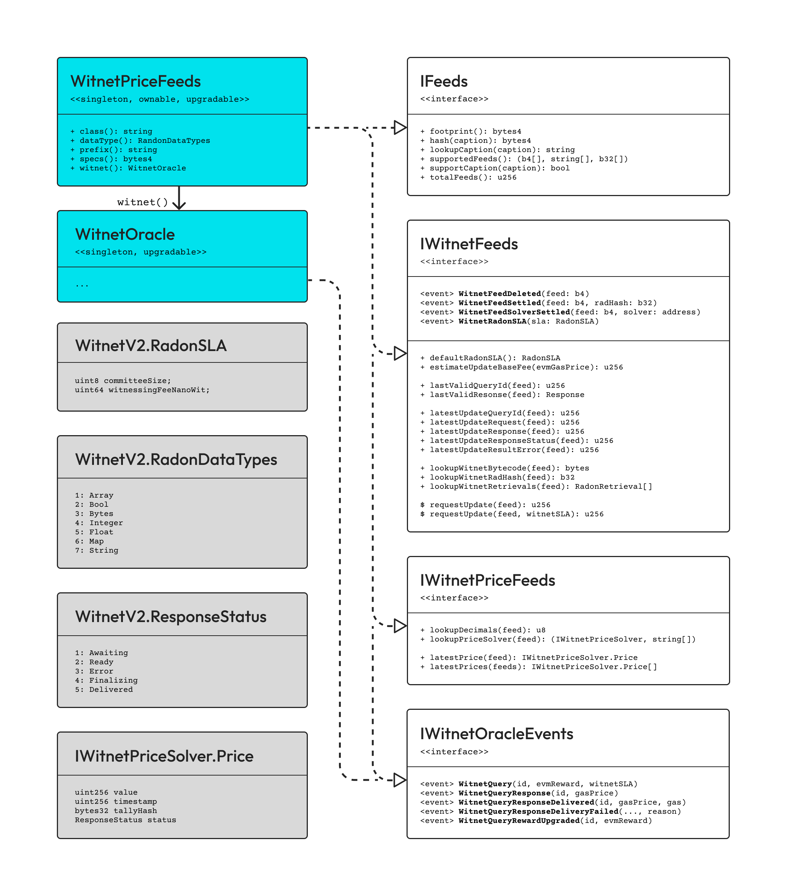

# 📃 WitnetPriceFeeds

Relying on the [_**WitnetOracle**_](../core/witnetoracle.md), this contract acts as a third-party oracle solution for the provisioning of regularly updated price feeds, where price feeds get identified by a descriptive string tag ([see ERC-2362](https://github.com/adoracles/EIPs/blob/erc-2362/EIPS/eip-2362.md)). Unlike most other price feed oracles, price updates on a _**WitnetPriceFeeds**_ contract can be pulled at anytime by any consuming contract. Moreover, all provided price updates (both values and timestamps) can be proven to be 100% truthful to the public sources being used, with no human-driven workflows involved at all, while providing a 15-minute finalization period in worst-case scenarios.


[supported-chains.md](../../../supported-chains.md)


<figure><figcaption></figcaption></figure>

## Interfaces


^   Pure methods that neither write nor read from storage.

\=   View methods that read from immutable code storage.

::    View methods that read from storage.

\+   Methods that may potentially alter storage.

$   Payable methods that may potentially alter storage.

\[]!  Methods that may revert under certain conditions.&#x20;


### IFeeds

<table data-full-width="false"><thead><tr><th width="405">Methods</th><th>Description</th></tr></thead><tbody><tr><td>:: <code>footprint(): bytes4</code></td><td>Returns a unique hash determined by the combination of data sources being used by supported non-routed price feeds, and dependencies of all supported routed price feeds. The footprint changes if any price feed is modified, added, removed or if the dependency tree of any routed price feed is altered.</td></tr><tr><td>^ <code>hash(string): bytes4</code></td><td>This pure function determines the ERC-2362 identifier of the given data feed caption string, truncated to <code>bytes4</code>.</td></tr><tr><td>:: <code>lookupCaption(bytes4): string</code></td><td>Returns the ERC-2362 caption of the given feed identifier, if known. </td></tr><tr><td>:: <code>supportedFeeds():(b4[],str[],b32[])</code></td><td>Returns the list of feed ids, captions and RAD hashes of all currently supported data feeds. The RAD hash of a data feed determines in a verifiable way the actual data sources and off-chain computations solved by the Witnet oracle blockchain upon every data update. The RAD hash value for a routed feed actually contains the address of the <code>IWitnetPriceSolver</code> logic contract that solves it.</td></tr><tr><td>:: <code>supportsCaption(string): bool</code></td><td>Tells whether the given ERC-2362 feed caption is currently supported.</td></tr><tr><td>:: <code>totalFeeds(): uint256</code></td><td>Total number of data feeds, routed or not, that are currently supported.</td></tr></tbody></table>

### IWitnetFeeds

<table data-full-width="false"><thead><tr><th width="413">Methods</th><th>Description</th></tr></thead><tbody><tr><td>= <code>dataType(): Witnet.RadonDataTypes</code></td><td>Primitive data type produced by successful data updates of all supported feeds (e.g. <code>Witnet.RadonDataTypes.Integer</code> in <em>WitnetPriceFeeds</em>).</td></tr><tr><td>=<code>prefix(): string</code></td><td>ERC-2362 caption prefix shared by all supported feeds (e.g. <code>"Price-"</code> in <em>WitnetPriceFeeds</em>).</td></tr><tr><td>:: <code>defaultRadonSLA()</code></td><td>Default SLA data security parameters that will be fulfilled on Witnet upon every feed update, if no others are specified by the requester.</td></tr><tr><td>::<code>estimateUpdateRequestFee(uint256)</code></td><td>Estimates the minimum EVM fee required to be paid upon requesting a data update with the given the <code>_evmGasPrice</code> value.</td></tr><tr><td>:: <code>lastValidQueryId(bytes4)</code></td><td>Returns the query id (in the context of the <code>WitnetOracle</code> addressed by <code>witnet()</code>) that solved the most recently updated value for the given feed.</td></tr><tr><td>:: <code>lastValidResponse(bytes4)</code></td><td>Returns the actual response from the Witnet oracle blockchain to the last successful update for the given data feed.</td></tr><tr><td>:: <code>latestUpdateQueryId(bytes4)</code></td><td>Returns the Witnet query id of the latest update attempt for the given data feed.</td></tr><tr><td>:: <code>latestUpdateResponse(bytes4)</code></td><td>Returns the response from the Witnet oracle blockchain to the latest update attempt for the given data feed.</td></tr><tr><td>:: <code>latestUpdateResponseStatus(bytes4)</code></td><td>Tells the current response status of the latest update attempt for the given data feed.</td></tr><tr><td>:: <code>latestUpdateResultError(bytes4)</code></td><td>Describes the error returned from the Witnet oracle blockchain in response to the latest update attempt for the given data feed, if any.</td></tr><tr><td>:! <code>lookupWitnetBytecode(bytes4)</code></td><td>Returns the Witnet-compliant bytecode of the data retrieving script to be solved by the Witnet oracle blockchain upon every update of the given data feed.</td></tr><tr><td>:: <code>lookupWitnetRadHash(bytes4)</code></td><td>Returns the RAD hash that uniquely identifies the data retrieving script that gets solved by the Witnet oracle blockchain upon every update of the given data feed.</td></tr><tr><td>:: <code>lookupWitnetRetrievals(bytes4)</code></td><td>Returns the list of actual data sources and offchain computations for the given data feed.</td></tr><tr><td>$! <code>requestUpdate(bytes4): uint256</code></td><td>Triggers a fresh update on the Witnet oracle blockchain for the given data feed, using the <code>defaultRadonSLA()</code> security parameters.</td></tr><tr><td>$! <code>requestUpdate(bytes4,RadonSLA):u256</code></td><td>Triggers a fresh update for the given data feed, requiring also the SLA data security parameters that will have to be fulfilled on Witnet. </td></tr></tbody></table>

### IWitnetOracleAppliance

<table><thead><tr><th width="329">Methods</th><th>Description</th></tr></thead><tbody><tr><td>= <code>class(): string</code></td><td>Returns the name of the contract that's actually implementing the ABI's <code>specs()</code> logic.</td></tr><tr><td>= <code>specs(): bytes4</code></td><td>Returns the immutable ERC-165 id that represents the expected functionality as for the <em>WitnetPriceFeeds</em> ABI.</td></tr><tr><td>= <code>witnet(): WitnetOracle</code></td><td>Address of the underlying singleton <a href="../core/witnetoracle.md"><em>WitnetOracle</em></a> contract used for posting data feed update requests to be solved on the Witnet blockchain.</td></tr></tbody></table>

### IWitnetPriceFeeds

<table data-full-width="false"><thead><tr><th width="326">Methods</th><th>Description</th></tr></thead><tbody><tr><td>:: <code>lookupDecimals(bytes4)</code></td><td>Returns the number of decimals to be added to the the integer values provided for the given price, in order to determine its actual market denomination.</td></tr><tr><td>:: <code>lookupPriceSolver(bytes4)</code></td><td>Returns the address of the logic contract that solves a given routed price feed, and the list of the ids upon which this routed price feed relies. Routed price feeds are not directly solved by the Witnet oracle blockchain (i.e. live price feeds), but as an on-chain combination of other live price feeds and/or routed price feeds. If the given id corresponds to no routed price feed, a zero address will be returned.</td></tr><tr><td>:! <code>latestPrice(bytes4)</code></td><td>Returns the most recently updated  <code>IWitnetPriceSolver.Price</code> data point for the given price feed id.</td></tr><tr><td>:! <code>latestPrices(bytes4[])</code></td><td>Returns the most recently updated data points for the list of given price feeds.</td></tr></tbody></table>

## Events

### IERC2362

<table data-full-width="false"><thead><tr><th width="358">Methods</th><th>Description</th></tr></thead><tbody><tr><td>:: <code>valueFor(b32):(int,uint,uint)</code></td><td>Returns last valid price and timestamp values received so far, as well as the current update status code for the given data feed id: - <code>200</code>: no new update has been requested since the last successful report. - <code>400</code>: last update request failed but still no new update is currently in course.  - <code>404</code>: an update is currently in course, but has not yet been reported.</td></tr></tbody></table>

### IWitnetFeedsEvents

<table data-full-width="false"><thead><tr><th width="191">Events</th><th width="274">Arguments</th><th>Description</th></tr></thead><tbody><tr><td><strong><code>PullingUpdate</code></strong></td><td>
<code>address evmOrigin</code>

<code>address evmSender</code>

<code>bytes4  erc2362Id4</code>

<code>uint256 witOracleQueryId</code>
</td><td>A fresh update on the data feed identified as <code>erc2364Id4</code> has just been requested and paid for by some <code>evmSender</code>, under command of  the <code>evmOrigin</code> externally owned account. </td></tr></tbody></table>

### IWitnetOracleEvents

<table data-full-width="false"><thead><tr><th width="277">Events</th><th width="256">Arguments</th><th>Description</th></tr></thead><tbody><tr><td><strong><code>WitnetQuery</code></strong></td><td>
<code>address  evmRequester</code>

<code>uint256  evmGasPrice</code>

<code>uint256  evmReward</code>

<code>uint256  queryId</code>

<code>bytes32  queryRadHash</code>

<code>RadonSLA querySLA</code>
</td><td>Emitted every time a new data update is requested and paid for on the <em>WitnetPriceFeeds</em> contract.</td></tr><tr><td><strong><code>WitnetQueryUpgrade</code></strong></td><td>
<code>uint256 queryId</code>

<code>address evmSender</code>

<code>uint256 evmGasPrice</code>

<code>uint256 evmReward</code>
</td><td>Emitted if the EVM reward for solving an update request in course is increased in any amount.</td></tr></tbody></table>

## Structs

### IWitnetPriceSolver.Price

Most recently updated data about some price feed, as returned by either `latestPrice(bytes4)` and `latestPrices(bytes4)`.

<table><thead><tr><th width="182">Field</th><th width="264">Type</th><th>Description</th></tr></thead><tbody><tr><td><code>value</code></td><td><code>uint256</code></td><td>Most recently updated price value.</td></tr><tr><td><code>timestamp</code></td><td><code>uint256</code></td><td>Timestamp at which the most recently updated price was produced. </td></tr><tr><td><code>tallyHash</code></td><td><code>bytes32</code></td><td>Hash of the transaction in the Witnet oracle blockchain that produced the most recently updated price.</td></tr><tr><td><code>status</code></td><td><code>WitnetV2.ResponseStatus</code></td><td>Current status of the underlying price update attempt, if any.</td></tr></tbody></table>

### Witnet.RadonSLA

Required on `requestUpdate(bytes4,WitnetV2.RadonSLA)`. Returned by `defaultRadonSLA()`.

<table><thead><tr><th width="256">Field</th><th width="153">Type</th><th>Description</th></tr></thead><tbody><tr><td><code>committeeSize</code></td><td><code>uint8</code></td><td>Number of randomly selected nodes in the Witnet oracle blockchain that will take part in solving some price update.</td></tr><tr><td><code>witnessingFeeNanoWit</code></td><td><code>uint256</code></td><td>Reward in nanowits that will be paid to every node in the Witnet oracle blockchain involved in solving some price update. Randomly selected nodes in Witnet will have to stake a collateral 100x this amount in order to participate as witnesses.</td></tr></tbody></table>

### Witnet.Response

Actual data reported from the Witnet oracle blockchain in response to some update attempt.

<table><thead><tr><th width="214">Field</th><th width="115">Type</th><th>Description</th></tr></thead><tbody><tr><td><code>reporter</code></td><td><code>address</code></td><td>Bridge EVM address from which the query result was reported.</td></tr><tr><td><code>finality</code></td><td><code>uint64</code></td><td>Block number at which the query result can be considered to be final.</td></tr><tr><td><code>resultTimestamp</code></td><td><code>uint32</code></td><td>Timestamp at which the Witnet oracle blockchain produced the reported result.</td></tr><tr><td><code>resultTallyHash</code></td><td><code>bytes32</code></td><td>Hash of the transaction on the Witnet oracle blockchain that produced the actual query result.  </td></tr><tr><td><code>resultCborBytes</code></td><td><code>bytes</code></td><td>CBOR-encoded buffer containing the query result: either a primitive value (see <code>Witnet.RadonDataTypes</code> below), or an error. </td></tr></tbody></table>

### Witnet.ResultError

Struct describing an error reported from the Witnet blockchain, as returned by `latestUpdateResultError(bytes4)`.

<table><thead><tr><th width="119">Field</th><th width="263">Type</th><th>Description</th></tr></thead><tbody><tr><td><code>code</code></td><td><code>Witnet.ResultErrorCodes</code></td><td>Unique code identifying the actual error as reported from the Witnet blockchain.</td></tr><tr><td><code>reason</code></td><td><code>string</code></td><td>Human-readable description of the reported error from the Witnet blockchain. </td></tr></tbody></table>

## Enums

### Witnet.RadonDataTypes

Primitive data types that can be contained in successful results to Witnet data requests.

<table><thead><tr><th width="110">Hex</th><th width="146">Caption</th><th>Description</th></tr></thead><tbody><tr><td><code>0x01</code></td><td><code>Array</code></td><td>An array of CBOR values.</td></tr><tr><td><code>0x02</code></td><td><code>Bool</code></td><td>A CBOR-encoded boolean value.</td></tr><tr><td><code>0x03</code></td><td><code>Bytes</code></td><td>A CBOR-encoded bytes buffer.</td></tr><tr><td><code>0x04</code></td><td><code>Integer</code></td><td>A CBOR-encoded integer value.</td></tr><tr><td><code>0x05</code></td><td><code>Float</code></td><td>A CBOR-encoded float value.</td></tr><tr><td><code>0x06</code></td><td><code>Map</code></td><td>A key/value map of CBOR values.</td></tr><tr><td><code>0x07</code></td><td><code>String</code></td><td>A CBOR-encoded string value.</td></tr></tbody></table>

### Witnet.ResponseStatus

Possible response status of some given data feed update attempt.

<table><thead><tr><th width="110">Hex</th><th width="148">Caption</th><th>Description</th></tr></thead><tbody><tr><td><code>0x01</code></td><td><code>Awaiting</code></td><td>The underlying query is being solved on the Witnet oracle blockchain and its result has not yet been reported to the EVM storage. </td></tr><tr><td><code>0x02</code></td><td><code>Ready</code></td><td>The underlying query was successfully solved on Witnet, and the reported result can be considered to be final.</td></tr><tr><td><code>0x03</code></td><td><code>Error</code></td><td>The underlying query was solved with errors on the Witnet blockchain, and the reported error can be considered to be final.</td></tr><tr><td><code>0x04</code></td><td><code>Finalizing</code></td><td>The result to the underlying query is being bridged from the Witnet oracle blockchain but it cannot yet be considered to be final.</td></tr><tr><td><code>0x05</code></td><td><code>Delivered</code></td><td>The result to the underlying query, either successful or with errors, was already delivered to the requesting contract that paid for it. </td></tr></tbody></table>
