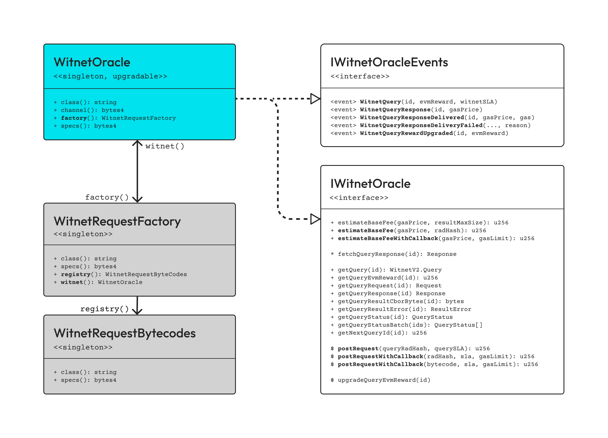

# Core

This section includes description of the core contracts and artifacts that enable developers and smart contracts to interact at the lowest possible level with the Witnet oracle blockchain, in order to:

* Build up Witnet-compliant custom data requests (i.e. [_**WitnetRequest**_](witnetrequest.md)), parameterized data sources and request templates (i.e. [_**WitnetRequestTemplate**_](witnetrequesttemplate.md)).
* Perform on-chain introspection of data sources, expected result data types, and off-chain computations of Witnet-complaint data requests and parameterized data sources.
* Post data queries to be bridged to, solved by and reported from the Witnet blockchain. Get data query results results posted back into the [_**WitnetOracle**_](witnetoracle.md) bridge storage (to be eventually read asynchronously), or right into your own consuming smart contracts (synchronously posted into your contract as soon as a result gets eventually reported from the Witnet blockchain).
* Estimate minimum base fees to be paid when posting data queries, depending on (a) whether the underlying Witnet-compliant data request was previously verified or not, (b) whether the query result is to be posted into the WitnetOracle storage or right into some requesting contract (i.e. callbacks), and (c) the expected EVM transaction gas price expected to pay when querying new data.&#x20;

<figure><figcaption></figcaption></figure>


[witnetoracle.md](witnetoracle.md)



[witnetradonregistry.md](witnetradonregistry.md)



[witnetrequest.md](witnetrequest.md)



[witnetrequestfactory.md](witnetrequestfactory.md)



[witnetrequesttemplate.md](witnetrequesttemplate.md)

