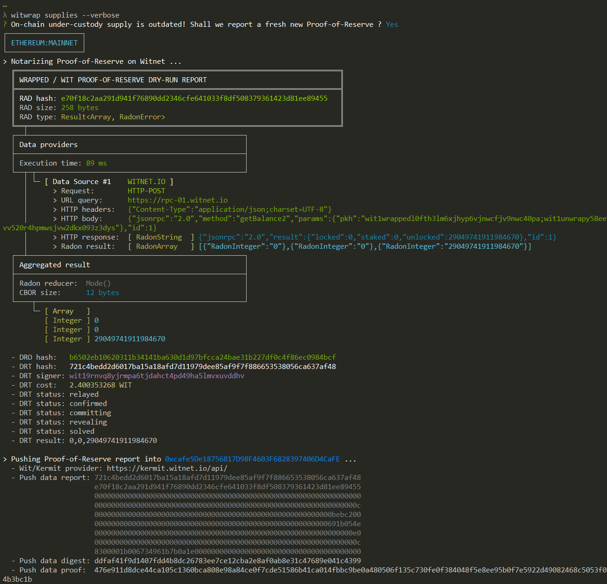
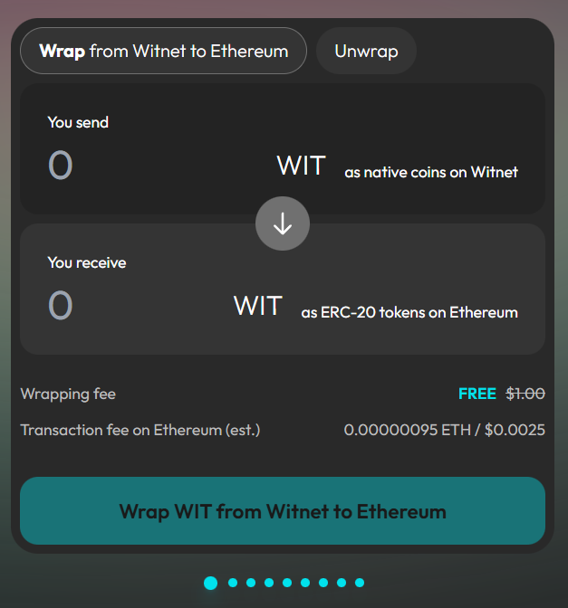

# 🥽 Witnet Ecosystem Apps

Become a pro by having a closer look into the open source applications already built for the Witnet Ecosystem:



<figure><figcaption></figcaption></figure>



#### myWitWallet

myWitWallet is a non-custodial Witnet-compliant wallet that allows you to send and receive WIT coins immediately.

This application is built using the [Flutter](https://docs.flutter.dev/get-started/install) framework, relying on [witnet.dart library](https://github.com/witnet/witnet.dart).

<a href="https://github.com/witnet/my-wit-wallet" class="button primary">Learn more</a>





#### Sheikah Wallet

Sheikah keeps your WIT coins safe and helps you build, share and deploy data requests into the Witnet network.

This is a web/desktop application built with [Electron](https://electronjs.org/), based on the App/Wallet/Node multi-layer architecture.

<a href="https://github.com/witnet/sheikah" class="button primary">Learn more</a>




<figure><figcaption></figcaption></figure>






<figure><figcaption></figcaption></figure>



#### Wrapped/WIT Node.js CLI

A command-line tool to wrap and unwrap WIT coins between Witnet and Ethereum blockchains, using specific RPC endpoints for each.

Built on top of Node.js using the [@witnet/sdk NPM package](https://www.npmjs.com/package/@witnet/sdk).

<a href="https://github.com/witnet/witnet-wrapped-wit" class="button primary">Learn more</a>





#### Wrapped/WIT Vue3 Webapp

The official webapp for wrapping native WIT into Ethereum ERC-20 tokens, and vice versa.

This is a web application built with [Vue3](https://vuejs.org/), leveraging the [@witnet/sdk NPM package](https://www.npmjs.com/package/@witnet/sdk).

<a href="https://github.com/witnet/wrapped-wit-ui" class="button primary">Learn more</a>



<figure><figcaption></figcaption></figure>


